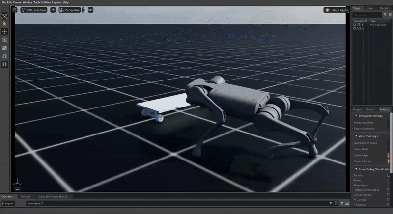

## Demo 



## Installation

- Install Isaac Lab by following the [installation guide](https://isaac-sim.github.io/IsaacLab/main/source/setup/installation/index.html). We recommend using the conda installation as it simplifies calling Python scripts from the terminal.

- Clone this repository separately from the Isaac Lab installation (i.e. outside the `IsaacLab` directory):

  ```bash
  git clone https://github.com/fan-ziqi/robot_lab.git
  ```

- Using a python interpreter that has Isaac Lab installed, install the library

  ```bash
  python -m pip install -e source/robot_lab
  ```

- Verify that the extension is correctly installed by running the following command to print all the available environments in the extension:

  ```bash
  python scripts/tools/list_envs.py
  ```

<details>

<summary>Set up IDE (Optional, click to expand)</summary>

To setup the IDE, please follow these instructions:

- Run VSCode Tasks, by pressing `Ctrl+Shift+P`, selecting `Tasks: Run Task` and running the `setup_python_env` in the drop down menu. When running this task, you will be prompted to add the absolute path to your Isaac Sim installation.

If everything executes correctly, it should create a file .python.env in the `.vscode` directory. The file contains the python paths to all the extensions provided by Isaac Sim and Omniverse. This helps in indexing all the python modules for intelligent suggestions while writing code.

</details>

<details>

<summary>Setup as Omniverse Extension (Optional, click to expand)</summary>

We provide an example UI extension that will load upon enabling your extension defined in `source/robot_lab/robot_lab/ui_extension_example.py`.

To enable your extension, follow these steps:

1. **Add the search path of your repository** to the extension manager:
    - Navigate to the extension manager using `Window` -> `Extensions`.
    - Click on the **Hamburger Icon** (☰), then go to `Settings`.
    - In the `Extension Search Paths`, enter the absolute path to `robot_lab/source`
    - If not already present, in the `Extension Search Paths`, enter the path that leads to Isaac Lab's extension directory directory (`IsaacLab/source`)
    - Click on the **Hamburger Icon** (☰), then click `Refresh`.

2. **Search and enable your extension**:
    - Find your extension under the `Third Party` category.
    - Toggle it to enable your extension.

</details>

## Docker setup

<details>

<summary>Click to expand</summary>

### Building Isaac Lab Base Image

Currently, we don't have the Docker for Isaac Lab publicly available. Hence, you'd need to build the docker image
for Isaac Lab locally by following the steps [here](https://isaac-sim.github.io/IsaacLab/main/source/deployment/index.html).

Once you have built the base Isaac Lab image, you can check it exists by doing:

```bash
docker images

# Output should look something like:
#
# REPOSITORY                       TAG       IMAGE ID       CREATED          SIZE
# isaac-lab-base                   latest    28be62af627e   32 minutes ago   18.9GB
```

### Building robot_lab Image

Following above, you can build the docker container for this project. It is called `robot-lab`. However,
you can modify this name inside the [`docker/docker-compose.yaml`](docker/docker-compose.yaml).

```bash
cd docker
docker compose --env-file .env.base --file docker-compose.yaml build robot-lab
```

You can verify the image is built successfully using the same command as earlier:

```bash
docker images

# Output should look something like:
#
# REPOSITORY                       TAG       IMAGE ID       CREATED             SIZE
# robot-lab                        latest    00b00b647e1b   2 minutes ago       18.9GB
# isaac-lab-base                   latest    892938acb55c   About an hour ago   18.9GB
```

### Running the container

After building, the usual next step is to start the containers associated with your services. You can do this with:

```bash
docker compose --env-file .env.base --file docker-compose.yaml up
```

This will start the services defined in your `docker-compose.yaml` file, including robot-lab.

If you want to run it in detached mode (in the background), use:

```bash
docker compose --env-file .env.base --file docker-compose.yaml up -d
```

### Interacting with a running container

If you want to run commands inside the running container, you can use the `exec` command:

```bash
docker exec --interactive --tty -e DISPLAY=${DISPLAY} robot-lab /bin/bash
```

### Shutting down the container

When you are done or want to stop the running containers, you can bring down the services:

```bash
docker compose --env-file .env.base --file docker-compose.yaml down
```

This stops and removes the containers, but keeps the images.

</details>

## Launch the Skateboard Mounting

Lanch a train:
```
python scripts/rsl_rl/base/train.py --task RobotLab-Isaac-Velocity-Flat-Unitree-A1-v0 --headless
```

Lanch a play:
```
python scripts/rsl_rl/base/play.py --task RobotLab-Isaac-Velocity-Flat-Unitree-A1-v0  --num_envs 1
```


## Troubleshooting

### Pylance Missing Indexing of Extensions

In some VsCode versions, the indexing of part of the extensions is missing. In this case, add the path to your extension in `.vscode/settings.json` under the key `"python.analysis.extraPaths"`.

**Note: Replace `<path-to-isaac-lab>` with your own IsaacLab path.**

```json
{
    "python.analysis.extraPaths": [
        "${workspaceFolder}/source/robot_lab",
        "/<path-to-isaac-lab>/source/isaaclab",
        "/<path-to-isaac-lab>/source/isaaclab_assets",
        "/<path-to-isaac-lab>/source/isaaclab_mimic",
        "/<path-to-isaac-lab>/source/isaaclab_rl",
        "/<path-to-isaac-lab>/source/isaaclab_tasks",
    ]
}
```

## Citation

Please cite the following if you use this code or parts of it:

```
Submitted to IEEE CDC. Waiting for a review
```

## Acknowledgements

The project uses some code from the following open-source code repositories:

- [Alescontrela/AMP_for_hardware](https://github.com/Alescontrela/AMP_for_hardware)
